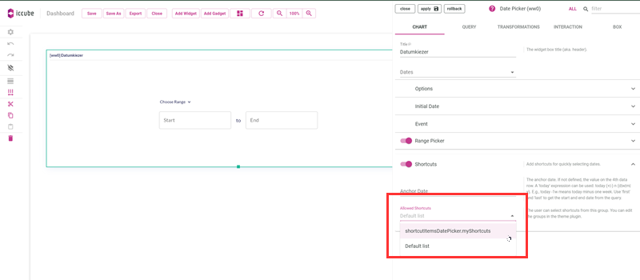

## Date Picker Shortcuts

A plugin can define custom Date Picker Shortcuts (e.g., `Yesterday`, `Last 30 days`).

### Customize Date Picker Shortcuts

The example below shows how to create a `Today` shortcut for your single-date date picker, and a `Last 7 days` for your range date picker.
In your [theme](Theme.md) options, add the following to the `ic3` part:

```typescript
themeOptions.ic3.datePicker = {
    shortcuts: {
        'myShortcuts': {
            datePickerShortcuts: [
                {
                    name: 'today',
                    getValue: (dateUtil) => {
                        const today = dateUtil.currentDate();
                        return today;
                    },
                }
            ],
            rangePickerShortcuts: [
                {
                    name: 'last_7_days',
                    getValue: (dateUtil) => {
                        const today = dateUtil.currentDate();
                        return [today.subtract(7 - 1, 'day'), today];
                    },
                }
            ]
        }
    }
}

```

Note that you can build multiple custom lists of shortcuts for both single-date date pickers and range date pickers.

### In Dashboard Editor

Once you added the list of shortcuts, you can select the list in the datepicker charts options.



_
