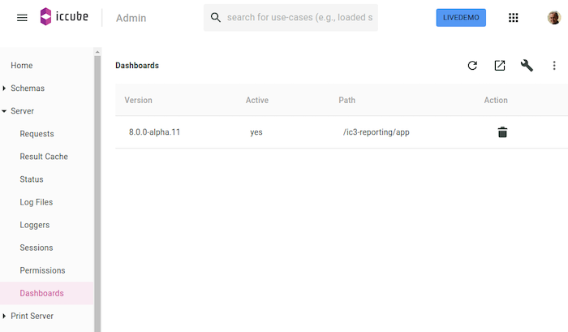

## Installation & Plugin Configuration

In the Dashboards use case of the Admin console, use the top right wrench icon or drag & drop the ZIP file directly into
the table:



### Configuration

The file `ic3report-config.js` in the `/ic3-reporting/app-local` directory allows for configuring the Dashboards
application and amongst others for listing the plugins to load. The context object allows for accessing extra
information (e.g., the name and the role of the user) to perform ad-hoc configuration.

```javascript
const ic3config = function (mode, options, context) {

    console.log("[ic3-config] mode [" + mode + "] processing the options", options, context);

    // Plugins ( mode = "production"|"development" ) .

    if (mode === "production") {

        options.plugins = options.plugins || [];

        options.plugins.push({
            url: "plugins/amcharts4/remoteEntry.js",
            scope: "amCharts4",
            module: "./PluginDefinition",
        });

    }

}
```

_