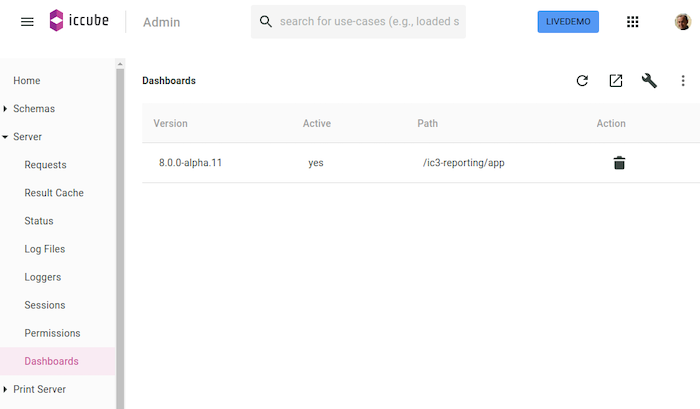

## icCube Dashboards Install

The Dashboards application can be installed on an icCube server v7.12 onwards.

In the Dashboards use case of the Admin console, use the top right wrench icon or drag & drop the ZIP file directly into
the table:



If your icCube server does not support yet officially the new Dashboards application (i.e., the Dashboards use case is
missing in the Admin console - see image above) please refer to the [manual-installation](#manual-installation)
section later in this document.

### Configuration

The file `ic3report-config.js` in the `/ic3-reporting/app-local` directory allows for configuring the Dashboards
application and amongst others for listing the plugins to load:

```javascript
const ic3config = function (mode, options) {

    console.log("[ic3-config] mode [" + mode + "] processing the options", options);

    // Plugins ( mode = "production"|"development" ) .

    if (mode === "production") {

        options.plugins = options.plugins || [];

        options.plugins.push({
            url: "plugins/amcharts4/remoteEntry.js",
            scope: "amCharts4",
            module: "./PluginDefinition",
        });

    }

}
```

### Manual Installation

Installing manually the Dashboards application requires some manual setup of the `Docs` application.

#### One Time Server Setup

In the `Web Docs` folder ensure to have the following folders:

    /ic3-reporting
        /app-local
        /data
            /entities
                /applications
            /shared
            /users

with the following permissions:

    :/ic3-reporting/data/entities
    + [<everybody>] READ
    
    :/ic3-reporting/data/shared
    + [<everybody>] READ

#### ZIP Deployment

In the `Web Docs:/ic3-reporting` rename (to keep a backup) or delete the folders:

    /app
    /doc
    /plugins

Then upload and unzip the Dashboards kit into the `Web Docs:/ic3-reporting` folder:

    /app
    /doc
    /plugins

_