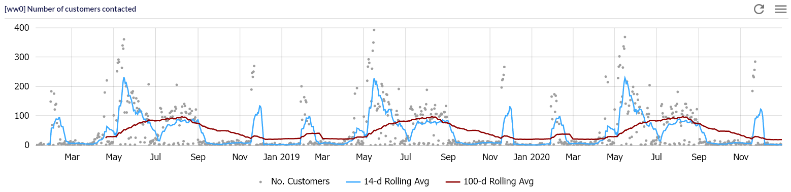

# amCharts 4 Widget Template

In this tutorial we show how to create a new AmCharts widget using a pre-defined template. The goal is to create
a chart that shows a timeseries as dots and the 14 and 100 day moving averages. See the image below for the end
result.



You can view the source code of the plugin in the GitHub project
[ic3-demo-plugin-js](https://github.com/ic3-software/ic3-demo-plugin-js).

Code-wise, the plugin takes the following steps to create and update a chart:

1. The code in `AmCharts4PredictiveTimeSeriesDefinition.ts` creates a new template definition
   called `Amcharts4PredictiveTimeSeriesDefinition`. `PluginDefinition.ts` registers the template.
2. In the definition, `mdxBuilderSettings`, `eventRoles` and `chartOptionsMeta`
   define the options, events and data-mapping for the boxplot widget.
3. `resolveDefinition` lazy loads the render function in `Amcharts4PredictiveTimeSeries.ts`. We use lazy loading here,
   so that the amCharts library only loads when it's needed in the report.
4. In the `AmCharts4PredictiveTimeSeries` class, the constructor creates the chart and the `onDataUpdated`
   method updates it. The class calls the update method when it receives new data or options.

### Create a New Template Definition

In `AmCharts4PredictiveTimeSeriesDefinition.ts`, we define the template for the time series chart. Note the following
settings:

- The `type` of the template is equal to `WidgetTemplateDefinitionType.Chart`.
- The `id` equals `PredictiveTimeSeries`. We use this ID in `PluginLocalization.csv` to change the display name of the
  widget, caption and options of the widget.
- The `groupId` sets the group of the widget in the widget-selection menu.
- `image` sets the image for the widget-selection menu.
- We set `handlesWidgetStatus` to true, so that the template controls when the widget has finished rendering. We do
  this, because the chart might render for longer than the widget. The `AmCharts4Base` class handles the render-status
  for you.
- In `resolveDefinition`, we load the part of the template that requires the amCharts plugin. In the example, add the
  `jsCode` part requires it. Internally, icCube calls `resolveDefinition` if there is one and waits for the rest of
  the template to load before continuing. In the browser, with the network developer tools, you can see that icCube
  only loads amCharts when the chart starts rendering.

### Setup Data-Mapping and Events

Each data-driven component in the chart gets mapped to a column of the table. The user does this by either manually
mapping the columns, or by using the query builder. In our example, data-driven components are the x-axis labels, the
value and the optional rolling averages.

In the function `ChartOptionsMeta()` and in the template's `mdxBuilderSettings`, you can see the setup for the
data-mapping. Note that the names of the options, and the axes in the builder settings are the same.

The setup for the events is in `eventRoles`. The widget has selection, and an event called `clicked-xAxis` that fires
when the user click a dot. Note that the method `getEventsToFire` uses the same name for the event as setup here.

### Creating and Updating the Chart

The constructor of the class `AmCharts4PredictiveTimeSeries` creates the chart. To add interactions, we use:

```typescript
this.addClickEventOnSprite(bullet, "tidyRow");
```

Which adds a click event to the dots of the `CircleBullet`. The data key `tidyRow` is because the chart data contains
a property called _tidyRow_ with the row-numbers of the tidy table.

In `onDataOptionsUpdated`, we get the columns using the alias from the chart-options. Next, we construct the amCharts
data using `getChartData`. This results in the following object.

```typescript
chart.data = [
    // ...,
    {
        rolling1: 170.07142857142858,
        rolling2: 58.0722891566265,
        tidyRow: 501,
        value: 133,
        xAxis: "Date Thu May 23 2019 00:00:00 GMT+0200 (Central European Summer Time"
    },
    // ...
];
```

In the method `onInterUpdated`, we change the state of each dot in the value-series to reflect the selection.
You can change the style for the selection in the constructor by changing the style of `selected` and `unselected`
states.

### Next Steps

Install the project from the GitHub page [ic3-demo-plugin-js](https://github.com/ic3-software/ic3-demo-plugin-js).
Then, you can build your own chart using the amCharts 4 library. For this, you can check out the amCharts 4 demos
on their [website](https://www.amcharts.com/demos-v4/).

You can also build a widget using another visualisation library. To make it work, you'll have to modify the
implementation of `AmCharts4ChartJS` and `AmCharts4Base` to work with that library.

_